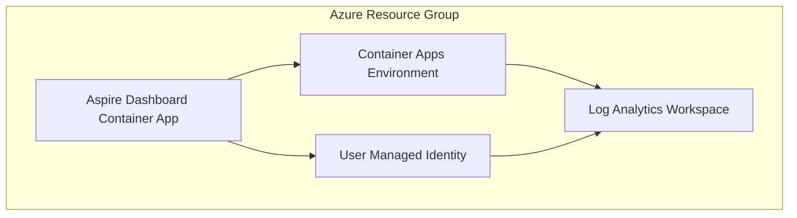

# .NET Aspire Dashboard - Development Environment

This directory contains the infrastructure as code (IaC) for deploying a .NET Aspire Dashboard in the development environment.

## Overview

The .NET Aspire Dashboard provides a rich web-based interface for monitoring and observing distributed applications built with .NET Aspire. This deployment includes:

- **Container Apps Environment**: Provides the hosting platform for containerized applications
- **Log Analytics Workspace**: Centralized logging and monitoring
- **Aspire Dashboard Container App**: The main dashboard application
- **User Managed Identity**: For secure access to Azure resources

## Architecture



## Resources Deployed

| Resource Type | Name Pattern | Purpose |
|---------------|--------------|---------|
| Log Analytics Workspace | `law-aspire-dev-usw2-001` | Centralized logging and monitoring |
| Container Apps Environment | `cae-aspire-dev-usw2-001` | Hosting platform for containers |
| Container App | `ca-aspire-aspire-dev-usw2-001` | .NET Aspire Dashboard application |
| User Managed Identity | `umi-aspire-dev-usw2-001` | Secure identity for resource access |

## Configuration

### Development Settings

- **Anonymous Access**: Enabled for easy development access
- **HTTPS**: Optional (HTTP allowed for dev convenience)
- **Replicas**: 1-3 instances with auto-scaling
- **Resources**: 0.5 CPU, 1Gi Memory per instance
- **Log Retention**: 30 days
- **Daily Log Quota**: 5GB

### Endpoints

- **Dashboard**: `https://{fqdn}` (Web interface)
- **OTLP Endpoint**: `http://{fqdn}:18889` (Telemetry ingestion)

## Deployment

### Prerequisites

1. Azure PowerShell module installed
2. Authenticated to Azure (`Connect-AzAccount`)
3. Appropriate permissions to create resources in the target subscription

### Deploy

```powershell
# Navigate to the deployment directory
cd bicep/rg-aspire-dev-usw2-001

# Perform what-if analysis
.\deploy-bicep-stack.ps1 -WhatIf

# Deploy the infrastructure
.\deploy-bicep-stack.ps1

# Or deploy with specific subscription
.\deploy-bicep-stack.ps1 -SubscriptionId "your-subscription-id"

# Force deployment without confirmation
.\deploy-bicep-stack.ps1 -Force
```

## Usage

### Accessing the Dashboard

After deployment, the dashboard will be available at the URL provided in the deployment outputs. In development mode, no authentication is required.

### Sending Telemetry

Configure your .NET Aspire applications to send telemetry to the OTLP endpoint:

```csharp
// In your Aspire AppHost project
var builder = DistributedApplication.CreateBuilder(args);

// Add OTLP export configuration
builder.Services.ConfigureOpenTelemetryTracerProvider(tracing => tracing
    .AddOtlpExporter(otlpOptions =>
    {
        otlpOptions.Endpoint = new Uri("http://{dashboard-fqdn}:18889");
    }));

// Your application services
var api = builder.AddProject<Projects.MyApi>("api");
var frontend = builder.AddProject<Projects.MyFrontend>("frontend")
    .WithReference(api);

builder.Build().Run();
```

### Environment Variables

The dashboard container is configured with the following environment variables:

- `ASPNETCORE_ENVIRONMENT`: Development
- `ASPNETCORE_URLS`: http://+:8080
- `DOTNET_DASHBOARD_OTLP_ENDPOINT_URL`: http://+:18889
- `DOTNET_DASHBOARD_UNSECURED_ALLOW_ANONYMOUS`: true

## Monitoring

The deployment includes comprehensive monitoring through:

- **Application Insights**: Built-in with Container Apps
- **Log Analytics**: Centralized logging from all components
- **Metrics**: Container and application metrics
- **Health Checks**: Liveness and readiness probes

## Troubleshooting

### Common Issues

1. **Container not starting**: Check the container logs in the Azure portal
2. **Dashboard not accessible**: Verify the ingress configuration and firewall rules
3. **No telemetry data**: Ensure OTLP endpoint is correctly configured in client applications

### Useful Commands

```powershell
# Check deployment status
Get-AzResourceGroupDeployment -ResourceGroupName "rg-aspire-dev-usw2-001"

# View container app logs
az containerapp logs show --name "ca-aspire-aspire-dev-usw2-001" --resource-group "rg-aspire-dev-usw2-001"

# Scale the container app
az containerapp update --name "ca-aspire-aspire-dev-usw2-001" --resource-group "rg-aspire-dev-usw2-001" --min-replicas 2 --max-replicas 5
```

## Cost Considerations

Development environment is optimized for cost:

- Minimal compute resources (0.5 CPU, 1Gi RAM)
- Low replica count (1-3 instances)
- Reduced log retention (30 days)
- Basic tier services where applicable

## Security

Development environment security features:

- Managed Identity for secure Azure resource access
- HTTPS available but not enforced
- Anonymous access enabled for convenience
- Network security through Container Apps Environment

## Related Resources

- [.NET Aspire Documentation](https://learn.microsoft.com/en-us/dotnet/aspire/)
- [Azure Container Apps Documentation](https://learn.microsoft.com/en-us/azure/container-apps/)
- [OpenTelemetry .NET Documentation](https://opentelemetry.io/docs/languages/net/)