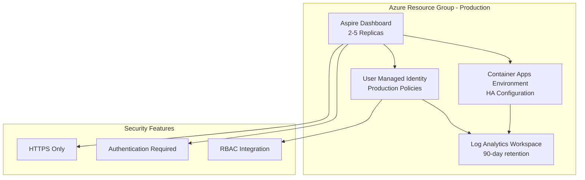

# .NET Aspire Dashboard - Production Environment

This directory contains the infrastructure as code (IaC) for deploying a .NET Aspire Dashboard in the production environment.

## Overview

The .NET Aspire Dashboard provides a rich web-based interface for monitoring and observing distributed applications built with .NET Aspire. This production deployment includes enterprise-grade features:

- **Container Apps Environment**: Highly available hosting platform
- **Log Analytics Workspace**: Extended retention and monitoring
- **Aspire Dashboard Container App**: Production-hardened dashboard
- **User Managed Identity**: Secure access with production policies

## Architecture



## Resources Deployed

| Resource Type | Name Pattern | Purpose |
|---------------|--------------|---------|
| Log Analytics Workspace | `law-aspire-prd-usw2-001` | Long-term logging and monitoring |
| Container Apps Environment | `cae-aspire-prd-usw2-001` | Production hosting platform |
| Container App | `ca-aspire-aspire-prd-usw2-001` | Production Aspire Dashboard |
| User Managed Identity | `umi-aspire-prd-usw2-001` | Production security identity |

## Production Configuration

### Security Settings

- **Anonymous Access**: ❌ **DISABLED** - Authentication required
- **HTTPS**: ✅ **ENFORCED** - HTTP redirected to HTTPS
- **Replicas**: 2-5 instances with high availability
- **Resources**: 1.0 CPU, 2Gi Memory per instance (production sizing)
- **Log Retention**: 90 days
- **Daily Log Quota**: 10GB

### Endpoints

- **Dashboard**: `https://{fqdn}` (Secure web interface)
- **OTLP Endpoint**: `http://{fqdn}:18889` (Telemetry ingestion)

## Deployment

### Prerequisites

1. Azure PowerShell module installed
2. Authenticated to Azure with production permissions
3. **Production deployment approval** from infrastructure team
4. Validated configuration in development environment first

### Production Deployment Process

```powershell
# Navigate to the production deployment directory
cd bicep/rg-aspire-prd-usw2-001

# MANDATORY: Perform what-if analysis first
.\deploy-bicep-stack.ps1 -WhatIf

# Review what-if results with team before proceeding

# Deploy with explicit confirmation
.\deploy-bicep-stack.ps1

# The script will require:
# 1. Typing 'PRODUCTION' to confirm environment
# 2. Typing 'yes' to proceed with deployment

# For automated deployments (CI/CD), use Force flag
.\deploy-bicep-stack.ps1 -Force -SubscriptionId "your-prod-subscription-id"
```

⚠️ **Production Deployment Guidelines**:
- Always run `-WhatIf` first and review changes
- Deploy during maintenance windows when possible
- Have rollback plan prepared
- Monitor deployment progress and post-deployment health

## Usage

### Accessing the Production Dashboard

The dashboard requires authentication in production mode. Access methods:

1. **Azure AD Integration**: Configure authentication through Azure AD
2. **Network Access**: Ensure proper network connectivity from your location
3. **RBAC Permissions**: Verify user has appropriate role assignments

### Production Telemetry Configuration

Configure your production .NET Aspire applications:

```csharp
// Production configuration in your Aspire AppHost
var builder = DistributedApplication.CreateBuilder(args);

// Production OTLP configuration with error handling
builder.Services.ConfigureOpenTelemetryTracerProvider(tracing => tracing
    .AddOtlpExporter(otlpOptions =>
    {
        otlpOptions.Endpoint = new Uri("http://{prod-dashboard-fqdn}:18889");
        // Add retry policies for production resilience
        otlpOptions.TimeoutMilliseconds = 30000;
        otlpOptions.BatchExportProcessorOptions = new()
        {
            MaxExportBatchSize = 512,
            ExporterTimeoutMilliseconds = 30000,
            ScheduledDelayMilliseconds = 5000
        };
    }));

// Production service configuration
var database = builder.AddPostgreSQL("postgres")
    .WithDataVolume()
    .AddDatabase("mydb");

var api = builder.AddProject<Projects.MyApi>("api")
    .WithReference(database)
    .WithReplicas(3); // Production replica count

var frontend = builder.AddProject<Projects.MyFrontend>("frontend")
    .WithReference(api)
    .WithReplicas(2);

builder.Build().Run();
```

### Environment Variables (Production)

- `ASPNETCORE_ENVIRONMENT`: Production
- `ASPNETCORE_URLS`: http://+:8080
- `DOTNET_DASHBOARD_OTLP_ENDPOINT_URL`: http://+:18889
- `DOTNET_DASHBOARD_UNSECURED_ALLOW_ANONYMOUS`: false ⚠️ **Security: Authentication enforced**

## Production Monitoring

Enhanced monitoring for production:

### Health Monitoring
- **Liveness Probes**: 30-second intervals with proper timeouts
- **Readiness Probes**: 10-second intervals for traffic management
- **Application Insights**: Full telemetry with alerting
- **Log Analytics**: 90-day retention with alert rules

### Alerting Configuration

Recommended alerts to configure:

```kusto
// Container App Health Alert
ContainerAppConsoleLogs_CL
| where ContainerName_s == "aspire-dashboard"
| where Log_s contains "ERROR" or Log_s contains "FATAL"
| summarize count() by bin(TimeGenerated, 5m)
| where count_ > 10

// High CPU/Memory Usage
ContainerAppSystemLogs_CL
| where ContainerName_s == "aspire-dashboard"
| where Log_s contains "cpu" or Log_s contains "memory"
| summarize avg(todouble(extractjson("$.value", Log_s))) by bin(TimeGenerated, 5m)
| where avg_todouble_extractjson___value__Log_s_ > 80
```

## Security

Production security features:

### Authentication & Authorization
- **No Anonymous Access**: All access requires authentication
- **HTTPS Only**: HTTP automatically redirects to HTTPS
- **Managed Identity**: Secure access to Azure resources
- **RBAC Integration**: Role-based access control

### Network Security
- Container Apps Environment isolation
- Private endpoint support (if configured)
- Ingress restrictions available

### Compliance
- Data encryption in transit and at rest
- Audit logging enabled
- Compliance with organizational policies

## Disaster Recovery

### Backup Strategy
- Log Analytics data: 90-day retention with export capabilities
- Container App configuration: Infrastructure as Code in Git
- Application data: Dependent on connected services

### Recovery Procedures
1. **Infrastructure Recovery**: Re-run deployment from IaC
2. **Data Recovery**: Restore from Log Analytics exports if needed
3. **Configuration Recovery**: Deploy from Git repository

## Troubleshooting

### Production Troubleshooting Guidelines

1. **Check Health Status**
   ```powershell
   # Get container app status
   az containerapp show --name "ca-aspire-aspire-prd-usw2-001" --resource-group "rg-aspire-prd-usw2-001" --query "properties.latestRevisionName,properties.runningStatus"
   ```

2. **View Application Logs**
   ```powershell
   # Stream logs (use carefully in production)
   az containerapp logs show --name "ca-aspire-aspire-prd-usw2-001" --resource-group "rg-aspire-prd-usw2-001" --follow
   ```

3. **Check Scaling Status**
   ```kusto
   ContainerAppSystemLogs_CL
   | where ContainerName_s == "aspire-dashboard"
   | where Log_s contains "scaling"
   | order by TimeGenerated desc
   | limit 10
   ```

### Common Production Issues

| Issue | Symptoms | Resolution |
|-------|----------|------------|
| Authentication Failures | 401/403 errors | Check Azure AD configuration and RBAC |
| High Latency | Slow dashboard response | Check resource utilization and scaling |
| Missing Telemetry | No data in dashboard | Verify OTLP endpoint configuration |
| Container Crashes | Service unavailable | Check logs and resource constraints |

## Cost Management

Production cost optimization:

### Monitoring Costs
- **Container Apps**: Monitor compute usage and scaling
- **Log Analytics**: Track data ingestion and retention costs  
- **Networking**: Monitor egress and ingress traffic

### Cost Optimization
- Right-size container resources based on usage patterns
- Adjust log retention periods as needed
- Use reserved capacity for predictable workloads

## Compliance & Governance

### Change Management
- All changes must go through approved change management process
- Deployment windows during maintenance periods
- Rollback procedures documented and tested

### Auditing
- All deployments logged with detailed change tracking
- Access auditing through Azure Activity Log
- Configuration drift detection

## Related Documentation

- [.NET Aspire Production Deployment Guide](https://learn.microsoft.com/en-us/dotnet/aspire/deployment/)
- [Azure Container Apps Security](https://learn.microsoft.com/en-us/azure/container-apps/security)
- [Production Observability Patterns](https://learn.microsoft.com/en-us/dotnet/aspire/fundamentals/observability)
- [OpenTelemetry Production Best Practices](https://opentelemetry.io/docs/reference/specification/performance/)

---

⚠️ **Important**: This is a production environment. All changes must follow established change management procedures and be thoroughly tested in development/staging environments first.